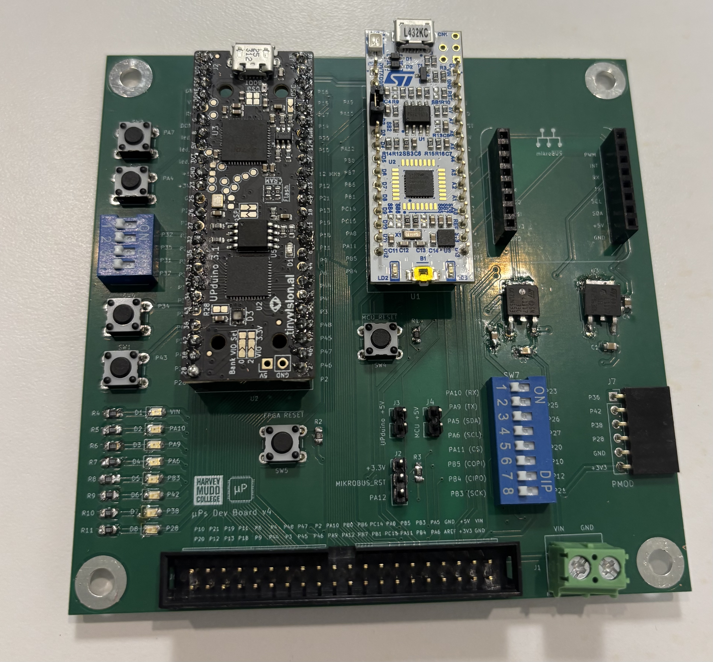
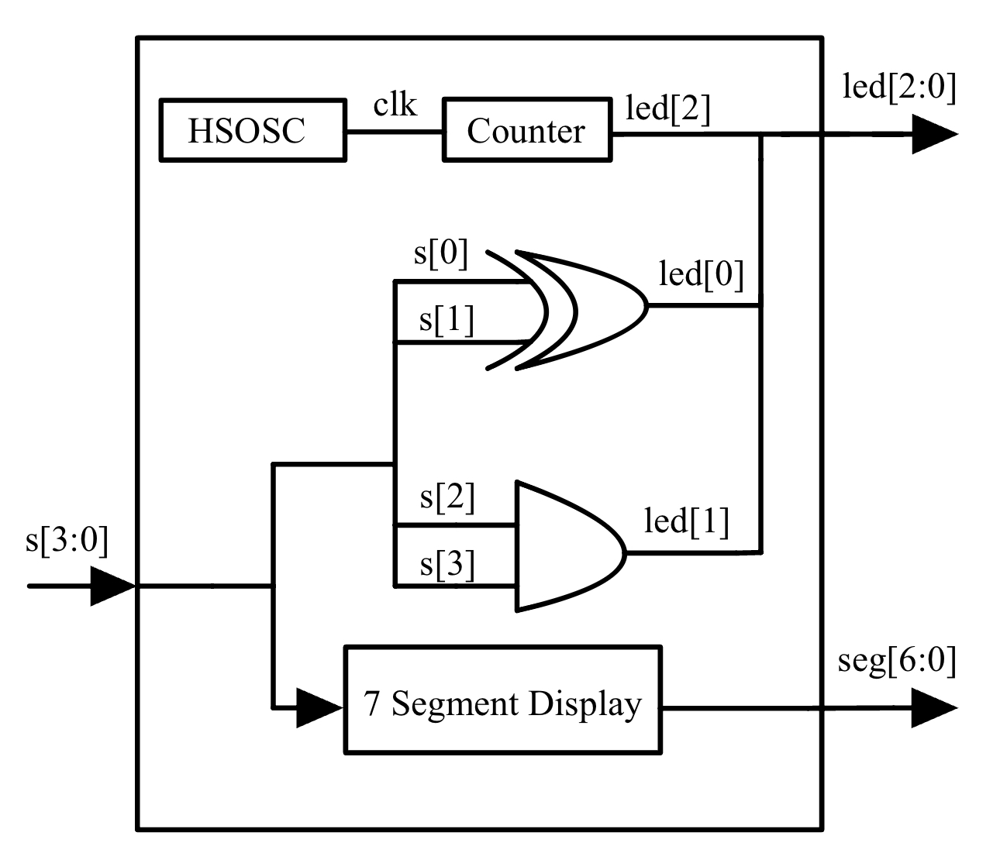
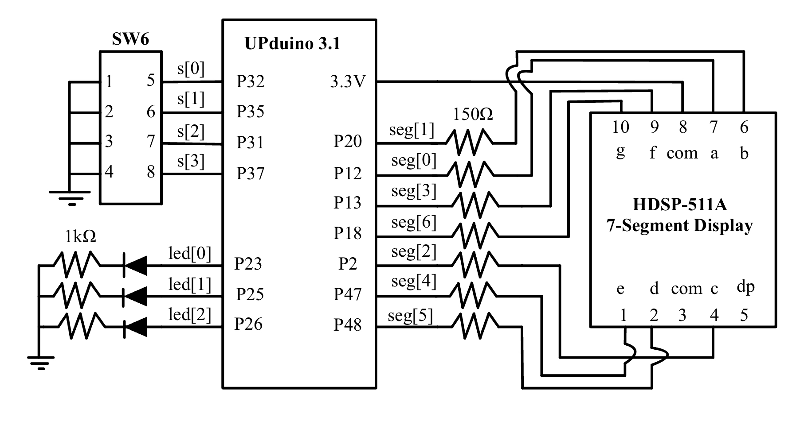
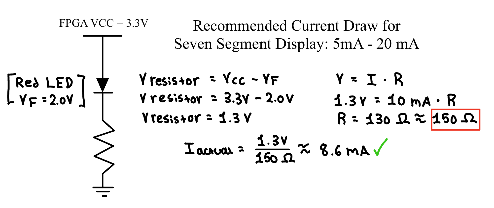
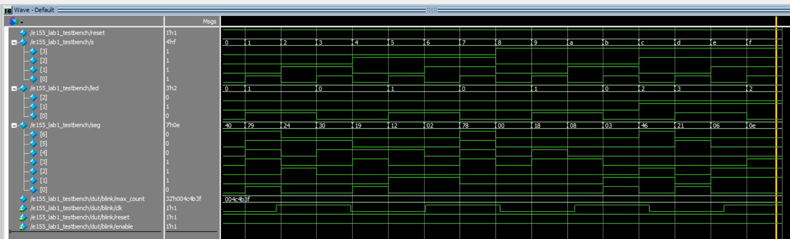
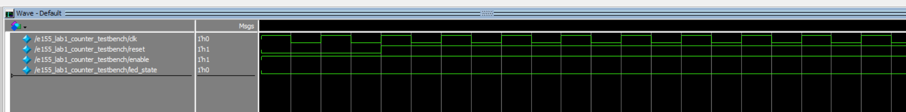
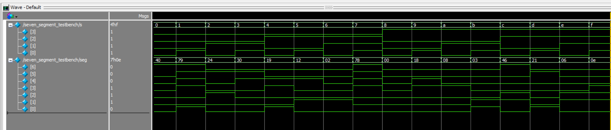

## Introduction

The purpose of this lab was to assemble a development board with an FPGA and MCU on-board. Then, digital designs were implemented using SystemVerilog to verify the hardware functionality. The board utilizes the onboard high-speed oscillator to drive a 2.4 Hz LED blink, map discrete logic to additional LEDs based on DIP switch inputs, and decode a 4-bit binary input to display hexadecimal characters `0` through `F` on a 7-segment display. 

[View the Source Code on GitHub](https://github.com/IvanJimenezPineda4/e155-lab1)

---

## Methods

### Development Board Setup

The development board system was assembled by soldering surface mount technology (SMT) and through-hole technology (THT) components. The development boards used for the project were the UPduino v3.1 FPGA and the Nucleo-L432KC MCU, which were connected to the board via female header pins. See Figure 1.

*Figure 1: Complete Development Board Board with all components soldered.*

### Testing FPGA & MCU

The FPGA and MCU were individually tested using provided LED blink code to verify proper hardware function, ensuring that the soldering was successful!

### FPGA Project Overview

After hardware verification, the FPGA was programmed to complete the following tasks. *Table 1* shows the signal types used for the project. `led[0]` and `led[1]` were designed to map to the DIP switches according to *Table 2* and *Table 3*, utilizing XOR and AND logic. `led[2]` was designated to blink asynchronously at 2.4 Hz.

*Table 1: Signals used for this lab.*

| Signal Name | Description |
|-------------|-------------|
| `clk`       | 48 MHz clock on FPGA generated by HSOSC |
| `s[3:0]`    | The 4 DIP switches (SW6) |
| `led[2:0]`  | 3 LEDs (on-board LEDs) |
| `seg[6:0]`  | 7-segment display |

*Table 2: Truth table of `led[0]`.*

| `S1` | `S0` | `led[0]` |
|----|----|--------|
| 0  | 0  | OFF |
| 0  | 1  | ON  |
| 1  | 0  | ON  |
| 1  | 1  | OFF |

*Table 3: Truth table of `led[1]`.*

| `S3` | `S2` | `led[1]` |
|----|----|--------|
| 0  | 0  | OFF |
| 0  | 1  | OFF |
| 1  | 0  | OFF |
| 1  | 1  | ON  |

For the 7-segment display, the four DIP switches correspond to a 4-bit binary number that produces hexadecimal characters `0` to `F`. For example, a DIP switch input of `4'b1010` outputs the character `A`.

---

## Documentation

The project was constructed using three system verilog modules including a top-level module (`e155_lab1_ivan.sv`), a sequential counter (`e155_lab1_counter_ivan.sv`), and a combinational decoder (`seven_segment.sv`). *Figure 2* below shows the block diagram of the modules. 

*Figure 2: Block diagram.*

### LED Implementation & Clock Divider

By inspection of the truth tables, `led[0]` is driven by the XOR of inputs `s[0]` and `s[1]`, while `led[1]` is driven by the AND of inputs `s[2]` and `s[3]`. These were implemented using `assign` statements in the top module. 

To generate a blinking frequency of 2.4 Hz for `led[2]`, a sequential counter module was designed. The 48 MHz on-board HSOSC was first divided in half using the `CLKHF_DIV(2'b01)` parameter, producing a 24 MHz clock. A blink rate of 2.4 Hz requires the LED to complete a full ON-OFF cycle 2.4 times per second, meaning the signal must toggle its state 4.8 times per second. By dividing 24,000,000 Hz by 4.8, we must toggle 5,000,000 clock cycles. A zero-indexed counter was implemented to trigger a toggle and reset upon reaching a max count of `4999999`.

### 7-Segment Display Implementation

The 7-segment display was designed using combinational logic to map the sixteen DIP switch states to output `0` to `F`. *Figure 3* shows the schematic for how the display, LEDs, and pull-up resistors on the DIP switches were wired. 

*Figure 3: Schematic showing the wiring of the 7-segment display to the FPGA and DIP switches.*

*Figure 4* provides the calculations for the current-limiting resistors required to operate the display safely within the 5 mA to 20 mA range, accounting for the 3.3V high and the 2.0V typical forward voltage of the LEDs.

*Figure 4: Calculations to justify the 7-segment display resistor values.*

---

## Results

The design successfully accomplished all tasks. To verify the logic prior to programming the hardware, testbenches were written for every module and simulated in Questa Sim. The combinational testbench verified all 16 states of the 7-segment display, the sequential testbench confirmed the counter's active-low reset and enable functions, and the testbench verified the integration of the modules. *Figure 5* confirms that the outputs perfectly matched expectations.

*Figure 5: Questa Sim waveform confirming LED and active-low 7-segment logic.*

*Figure 6: Questa Sim waveform confirming counter module.*

*Figure 7: Questa Sim waveform confirming seven segment module.*
---

## Conclusion

All designs were successfully implemented on the FPGA. The simulations matched expectations, and the physical hardware behaved exactly as intended. The lab took a total of 32 hours to complete. 

Through this lab, hands-on practice was gained in assembling a development board, structuring SystemVerilog code, writing testbenches, and working with many hardware components.

---

## AI Reflection

AI Prompt: Write SystemVerilog HDL to leverage the internal high speed oscillator in the Lattice UP5K FPGA and blink an LED at 2 Hz. Take full advantage of SystemVerilog syntax, for example, using logic instead of wire and reg.

The prompt was given to ChatGPT, and it created a good counter using systemverilog syntax. However, when the code was imported into Lattice Radiant and synthesized, it failed with the following error: Error ../source/impl_1/ai_proto.sv(15): instantiating unknown module SB_HFOSC. VERI-1063.
When the error was fed back to ChatGPT, it was not able to correct it. 

Overall, I would rate the quality of ChatGPT's output as a 5/10 because it did correctly calculate that a 48MHz clock required a 12,000,000 count to toggle twice a second for a 2Hz blink rate but it could not correct error messages from the synthesis. 