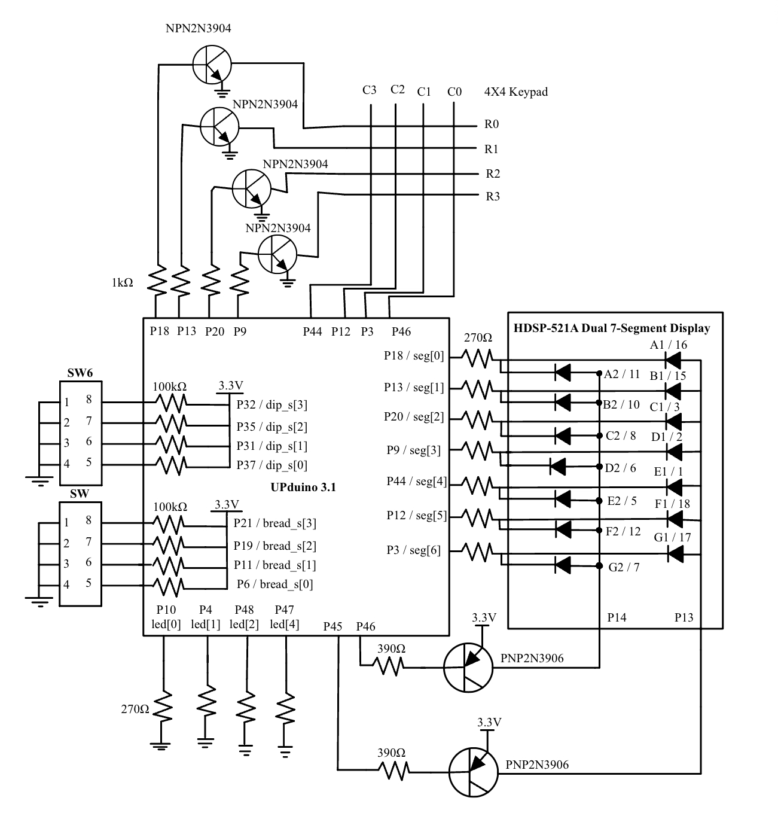
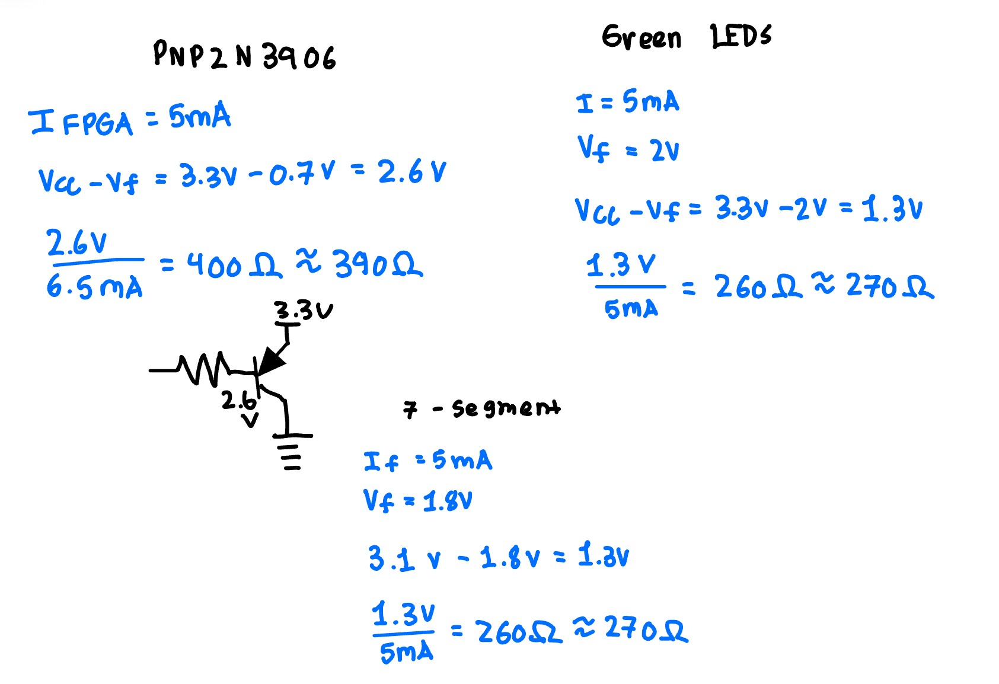
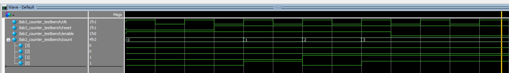
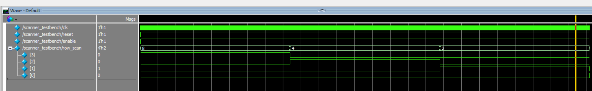
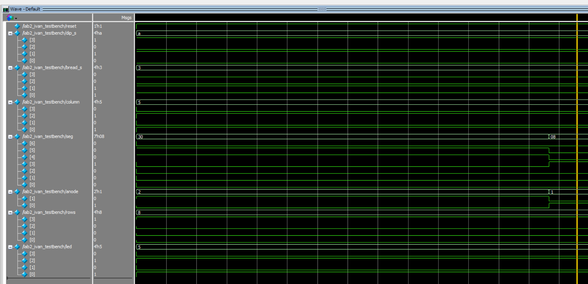
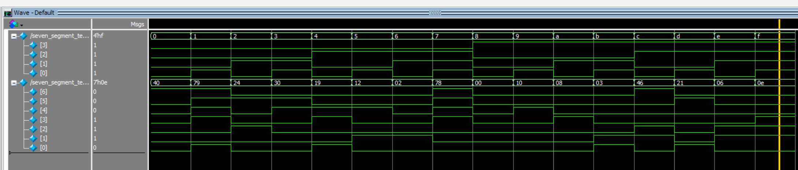

## Introduction

The purpose of this lab was to implement a time-multiplexing scheme to efficiently use the FPGA's I/O pins. The design drives two independent hexadecimal numbers on a dual seven-segment display using only a single seven-segment decoder module. Additionally, a scanning circuit was developed to interact with a 4x4 matrix keypad by driving its rows and reading its columns. The system was designed using SystemVerilog and verified using Questa Sim before physical implementation on the UPduino v3.1 development board.

[View the Source Code on GitHub](https://github.com/IvanJimenezPineda4/E155-Lab-2)

---

## Methods

### Time-Multiplexing Setup

Time-multiplexing allows a common hardware resource to be shared for several purposes at different times. A single seven-segment decoder was used to drive both digits of the display. To control which digit was active, the common anode of each display was toggled sequentially. Because the anode requires more current than the FPGA can directly supply, 2N3906 PNP transistors were utilized to switch the current.

### Matrix Keypad Scanning

The matrix keypad contains four rows and four columns, connected to 8 total pins. The scanning module asserts signals on each row one at a time and observes the values of the columns. To prevent short circuits when multiple keys in the same column are pressed simultaneously, an open-drain conversion circuit was built using 2N3904 NPN transistors. The FPGA drives the base of the transistor, the emitter is grounded, and the collector connects to the keypad row, allowing the output to float when deasserted. Internal pull-up resistors were configured on the FPGA column input pins to read the logic levels correctly.

### FPGA Project

The top-level design connects the inputs and outputs to achieve the multiplexing and scanning. *Table 1* outlines the primary signals used in the project.

*Table 1: Signals used for this lab.*

| Signal Name | Description |
|-------------|-------------|
| `int_osc`   | 24 MHz clock generated by dividing the 48 MHz HSOSC |
| `dip_s[3:0]`| 4-bit input from the on-board DIP switch |
| `bread_s[3:0]`| 4-bit input from the breadboard DIP switch |
| `column[3:0]`| 4-bit input reading the keypad columns |
| `seg[6:0]`  | Multiplexed 7-segment cathodes |
| `anode[1:0]`| PNP transistor drives for the dual displays |
| `rows[3:0]` | NPN open-drain transistor drives for the keypad scanner |
| `led[3:0]`  | Readback LEDs to verify keypad column signals |

---

## Documentation

The design includes a single time-multiplexed seven-segment decoder module, a counter module, a scanning module, and a top-level module. The top-level design only includes instances of these submodules and `assign` statements to route the multiplexing and scanning logic. *Figure 1* below shows the block diagram of the system.

*Figure 1: Block diagram representing the logic structure.*

### Counter & State Machines

All counting logic was handled by a single module. This module was instantiated twice in the top level. The first instance (`mux_cntr`) was parameterized to 17 bits to divide the 24 MHz clock down to a smaller frequency, ensuring the switching is imperceptible to the human eye.

The scanning module utilizes a 25-bit counter. The top two bits were extracted to create a 4-state machine that rotates the output sequence across the keypad rows (1000, 0100, 0010, 0001).

### Schematic & Electrical Calculations

*Figure 2* shows the complete schematic detailing the off-board components, including the 4x4 keypad, the dual 7-segment display, the LEDs, and the transistor driver circuits. 

*Figure 2: Schematic of off-board components and transistor circuits.*

Calculations were performed to ensure current draw and sink on all FPGA pins remained below the recommended limits. According to the iCE40 UltraPlus data sheet, the maximum output low current and output high current for the LVCMOS 3.3V standard is 8 mA. 

*Figure 3* provides the calculations for the series base resistors used on the NPN and PNP transistors. Accounting for a 3.3V logic high and a typical 0.7V base-emitter forward voltage, 1 k$\Omega$ resistors were selected to limit the FPGA pin current to 2.6 mA, well below the 8 mA threshold.

*Figure 3: Calculations to justify the transistor resistor values.*

---

## Results

Testbenches were developed to verify the modules automatically. The seven-segment decoder testbench verified all 16 hexadecimal states. The scanner testbench simulated massive delays to verify the active-low reset, the enable function, and all four state transitions. The top-level testbench exercised the multiplexer toggling and the combinational keypad logic. 

*Figure 4*, *Figure 5*, and *Figure 6* show the Questa Sim waveforms confirming the logic behaves exactly as intended.

*Figure 4: Questa Sim waveform confirming the counter logic.*

*Figure 5: Questa Sim waveform confirming the scanner state transitions.*

*Figure 6: Questa Sim waveform confirming the top-level multiplexing.*

*Figure 6: Questa Sim waveform confirming the seven segment display working.*

---

## Conclusion

The multiplexed dual display and the matrix keypad scanner were successfully implemented. The modular Verilog structure behaved seamlessly during simulation, and the physical open-drain and high-side transistor circuits operated the hardware safely. The design meets all specifications outlined for Lab 2. The lab took a total of 19 hours to complete. 

---

## AI Reflection

**AI Prompt:** Write SystemVerilog HDL to time multiplex a single seven segment decoder (that decodes from four bits to a common anode seven segment display) to decode two sets of input bits and drive two sets of seven output bits.

ChatGPT6 was not able to produce synthesizeable code.

**AI Prompt:** Write SystemVerilog HDL to time multiplex a single seven segment decoder (that decodes from four bits to a common anode seven segment display) to decode two sets of input bits and drive two sets of seven output bits. Use the seven segment decoder and oscillator provided in the attached files.

With context, ChatGPT6 was able to provide synthesizable code.

