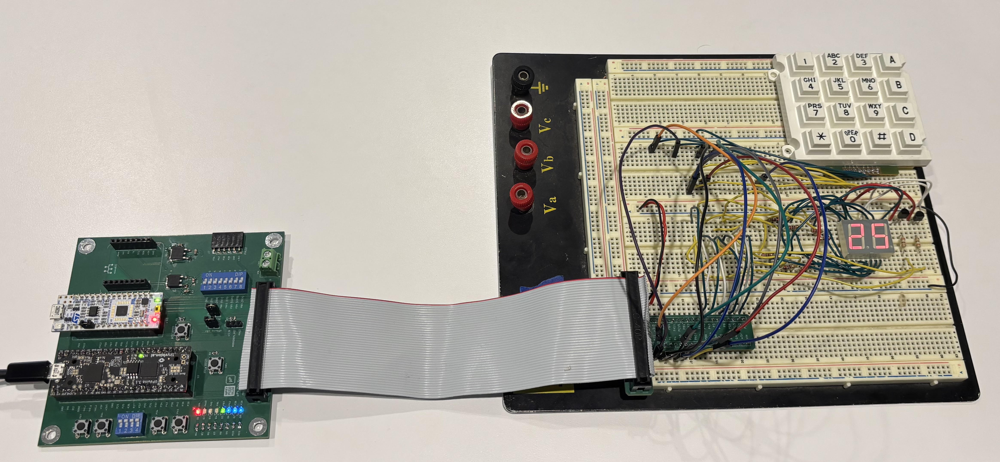
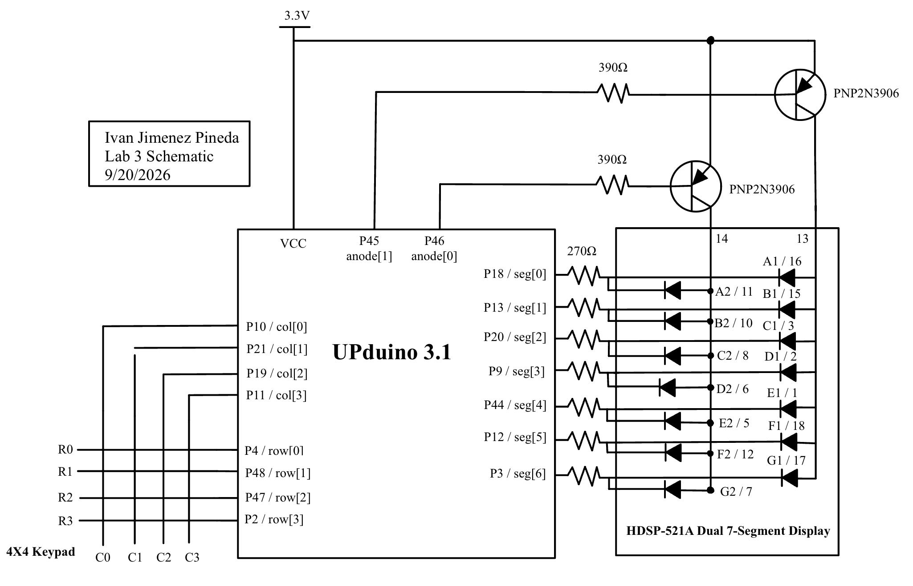
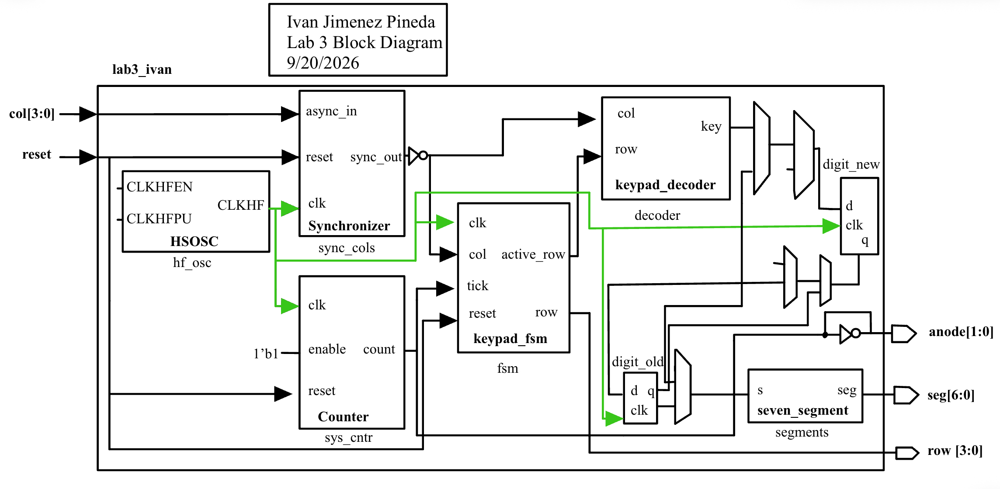
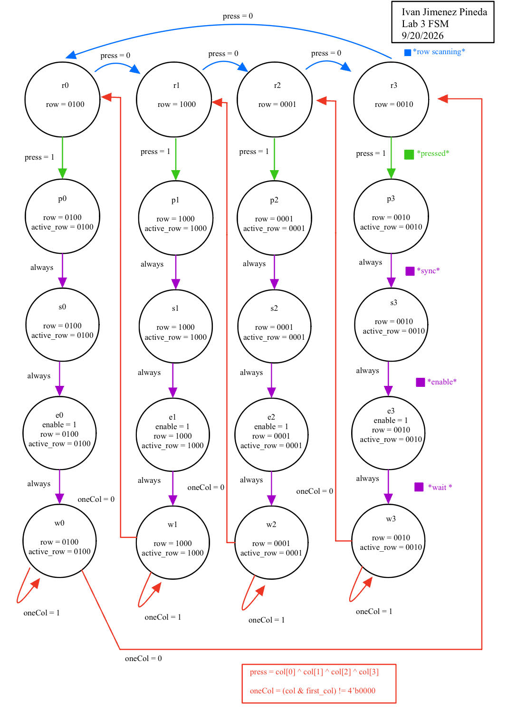
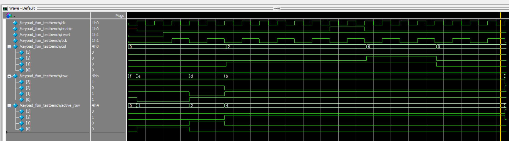
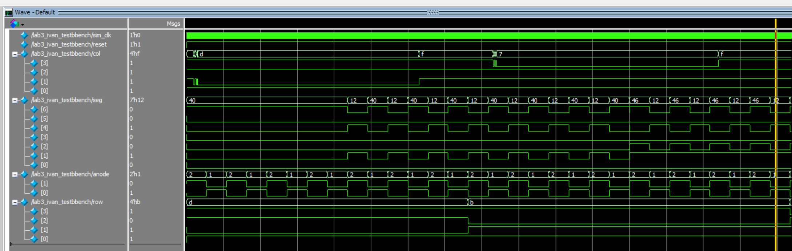
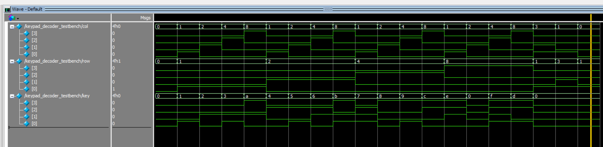
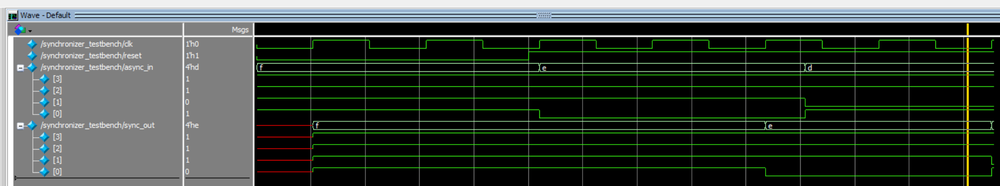

## Introduction

This lab focuses on designing a circuit interface to read a 4x4 matrix keypad and display the results on a dual seven-segment display. The design must display the last two hexadecimal digits pressed, with the most recent entry appearing on the right. Because mechanical switches are prone to bouncing making and breaking connections rapidly over a few milliseconds, the system must implement a debouncing strategy to ensure each key press is registered exactly once. Furthermore, the system must handle multi-press edge cases, ignoring additional inputs if a button is already held down and refusing to lock up if multiple buttons are pressed simultaneously. The design was written in SystemVerilog, verified using Questa Sim, and synthesized for the UPduino v3.1 FPGA.

*Figure 1: Keypad Scanner Circuit wired with a working multiplexed dual seven segment display

[View th Source Code on GitHub](https://github.com/IvanJimenezPineda4/E155-Lab-3)

---

## Methods

### Fully Synchronous Architecture & Clocking
To manage both the fast 24MHz system clock and the slower human scale input requirements, a fully synchronous architecture was installed using clock enables. A 17-bit `counter` module divides the 24MHz clock to generate a single-cycle `tick` approximately every 183Hz. This `tick` signal acts as an enable for the finite state machine and the multiplexer toggle, ensuring all sequential logic is evaluated safely on the primary 24MHz clock edge. 

### Debouncing Strategy & Tradeoffs
Switch bouncing was handled through the FSM's state transition timing. Because the FSM only evaluates state changes when the 183Hz `tick` is high, each state transition takes approximately 5.4 milliseconds. When a press is detected, the FSM must traverse from a scan state (`rX`), to a press detect state (`pX`), to a sync state (`sX`), and finally to an enable state (`eX`). This enforces an obligatory 16ms delay between initial contact and input registration, outlasting typical mechanical switch bounce. 

*   **Tradeoffs:** This FSM-based sampling method is highly resource-efficient and inherently synchronous. It eliminates the need for internal counter registers inside the FSM module. The primary tradeoff is a slight latency between the physical press and visual output. An alternative method running the FSM at 24MHz and using a large internal counter (counting to 500,000) would provide finer control over the exact debounce delay, but clutters the FSM logic with timers. Relying on a system-wide tick keeps the FSM strictly focused on state routing.

### Multi-Press and Metastability Handling
To resolve metastability when reading asynchronous human inputs, a 2-flop `synchronizer` module aligns the column inputs to the 24MHz clock before they reach the FSM. To prevent the system from locking up or misfiring when multiple buttons are pressed, the FSM utilizes decoder logic (`press = 1` ONLY if exactly one column is active). If multiple buttons are mashed, the FSM ignores the input and continues scanning. Once a valid press is registered, the FSM locks the active column into a `first_col` register and enters a wait state (`wX`). It remains trapped in this wait state as long as the original button is held, preventing auto-repeating digits. If multiple buttons are held down and all but one are released, the FSM will cycle back to the scan states, recognize the newly isolated button, and register it properly as a new single key press.

---

## Documentation

The lab is split into six modules to maintain clean Verilog structure and reuse previous designs. The top-level module (`lab3_ivan`) consists only of instantiated submodules and trivial routing logic. The `counter`, `synchronizer`, and `seven_segment` modules were isolated to handle their respective functions. 

*   **FSM Tradeoffs:** By keeping the combinational hex decoding in a separate `keypad_decoder` module, the FSM only needs to manage active row scanning and enabling. If the decoder logic were embedded inside the FSM, the next-state logic block would become unnecessarily bloated. Splitting them allows the FSM to output a simple `active_row` signal that the combinational decoder cross-references with the synchronized columns to yield the hex value.

### Block Diagram & Schematic

*Figure 2: Complete schematic showing all off-board components, wiring junctions, and standard component symbols.*

*Figure 3: Block diagram representing the Verilog code structure, including all submodules.*

### State Transition Diagram & Table

*Figure 4: State transition diagram illustrating the row scanning, debouncing, and wait states.*

*Table 1: Complete State Transition Table documenting the next state and output values.*

| Current State | Input Conditions | Next State | `row` (Active-Low) | `active_row` (Decoder) | `enable` |
| :--- | :--- | :--- | :--- | :--- | :--- |
| **r0** | `press` == 1 | **p0** | 1110 | 0001 | 0 |
| **r0** | `press` == 0 | **r1** | 1110 | 0001 | 0 |
| **p0** | (Always on tick) | **s0** | 1110 | 0001 | 0 |
| **s0** | (Always on tick) | **e0** | 1110 | 0001 | 0 |
| **e0** | (Always on tick) | **w0** | 1110 | 0001 | 1 |
| **w0** | `oneCol` == 1 | **w0** | 1110 | 0001 | 0 |
| **w0** | `oneCol` == 0 | **r0** | 1110 | 0001 | 0 |
| **r1** | `press` == 1 | **p1** | 1101 | 0010 | 0 |
| **r1** | `press` == 0 | **r2** | 1101 | 0010 | 0 |
| **p1** | (Always on tick) | **s1** | 1101 | 0010 | 0 |
| **s1** | (Always on tick) | **e1** | 1101 | 0010 | 0 |
| **e1** | (Always on tick) | **w1** | 1101 | 0010 | 1 |
| **w1** | `oneCol` == 1 | **w1** | 1101 | 0010 | 0 |
| **w1** | `oneCol` == 0 | **r1** | 1101 | 0010 | 0 |
| **r2** | `press` == 1 | **p2** | 1011 | 0100 | 0 |
| **r2** | `press` == 0 | **r3** | 1011 | 0100 | 0 |
| **p2** | (Always on tick) | **s2** | 1011 | 0100 | 0 |
| **s2** | (Always on tick) | **e2** | 1011 | 0100 | 0 |
| **e2** | (Always on tick) | **w2** | 1011 | 0100 | 1 |
| **w2** | `oneCol` == 1 | **w2** | 1011 | 0100 | 0 |
| **w2** | `oneCol` == 0 | **r2** | 1011 | 0100 | 0 |
| **r3** | `press` == 1 | **p3** | 0111 | 1000 | 0 |
| **r3** | `press` == 0 | **r0** | 0111 | 1000 | 0 |
| **p3** | (Always on tick) | **s3** | 0111 | 1000 | 0 |
| **s3** | (Always on tick) | **e3** | 0111 | 1000 | 0 |
| **e3** | (Always on tick) | **w3** | 0111 | 1000 | 1 |
| **w3** | `oneCol` == 1 | **w3** | 0111 | 1000 | 0 |
| **w3** | `oneCol` == 0 | **r3** | 0111 | 1000 | 0 |

---

## Results

Automatic testbenches were created to verify all modules before hardware deployment. The `keypad_decoder` testbench exercised all combinational mappings. The `synchronizer` testbench verified setup and hold isolation by placing inputs both directly on the clock edge and at asynchronous intervals. 

The top-level testbench simulated asynchronous switch bounce logic to mimic human input. The waveform results confirmed that the design successfully filters the noise and registers exactly one shift-register update per stable press.

*Figure 5: FSM Testbench waveform confirming the scan, debounce, and wait state transitions.*

*Figure 6: Top level waveform confirming that simulated switch bounce is safely ignored and the shift register updates cleanly.*

*Figure 7: Keypad Decoder waveforms confirming that simulated keys are mapped correctly.

*Figure 8: Synchronizer testbench waveforms confirming that simulated synchronizer correctly drives asynchronous inputs on clock edge.

### Synthesizer RTL Verification

*Figure 9: RTL Block Diagram generated by the synthesizer.*

A visual inspection of the synthesizer's RTL Netlist Analyzer output (Figure 9) confirms that the design contains zero latches and zero tristate buffers. All state-holding elements, such as the `digit_new` and `digit_old` registers, are synthesized as standard D flip-flops activated by the edge-triggered clock symbols on their input pins.

### Statement of Requirements

The design successfully meets all Proficiency and Excellence requirements outlined in the Lab 3 specifications. It correctly reads a 4x4 matrix keypad, features a robust FSM-based debouncing strategy that ignores multi-press overlaps, and drives a multiplexed dual seven-segment display fully synchronously without utilizing derived clocks or internal FSM counters.

**Design Verification:**
*   The circuit correctly reads inputs from the 4x4 keypad one digit at a time.
*   The dual seven-segment display successfully shows the last two hexadecimal digits pressed, shifting properly from right to left.
*   Each button press is registered exactly once.
*   The system operates fully synchronously using clock enables rather than nested or divided FSM clocks.
*   The design locks out secondary presses, resumes properly when dropping from a multi-press to a single press, and never locks up or displays an intermediate digit when mashed. 
*   Synthesizer output files confirm the design contains zero latches and zero tristate buffers.

---

## AI Reflection

## AI Prototype Reflection: Monolithic vs. Modular Prompting

The purpose of this AI prototype was to explore how Large Language Models handle design modularity when generating SystemVerilog for digital logic, specifically comparing a monolithic, all-at-once prompt against decomposed prompts. 

### Monolithic vs. Modular Prompt Performance
When given the monolithic prompt (Prototype A), ChatGPT5 successfully decomposed the design into four distinct modules without explicit instruction. A clock divider, a keypad scanner, a seven-segment multiplexer, and a top-level integration module. However, its initial implementation of the finite state machine inside the keypad scanner was faulty. It used a single enumerated state variable (`S_SCAN0` through `S_SCAN3` and `S_HELD`) to handle both the column iteration and the debounce wait state. 

By contrast, decomposing the prompts (Prototype B) forced the LLM to separate the physical row and column scanning from the debouncing logic. This modular approach produced a much cleaner architecture where the scanner simply outputted a continuous stream of pressed keys, and a dedicated `key_registration` module filtered those into a single `new_key` pulse. Modularizing the prompts significantly improved the readability of the FSMs by enforcing strict separation.

During synthesis in Lattice Radiant, I encountered two specific errors. The first was an `unknown module SB_HFOSC` error. When I fed this back to the LLM, it correctly identified that `SB_HFOSC` is a Lattice-specific primitive that might fail and it advised me to remove the direct instantiation and pass the clock in as a top-level port instead. The second issue was a `VERI-1063` error stating that `keypad_scanner` was an unknown module inside `clock_enable.sv`. The LLM identified this issue as a file structure issue, pointing out that I had likely pasted all the generated modules into a single file named `clock_enable.sv`, meaning the synthesis tool couldn't find the `keypad_scanner` definition when compiling other files. Once I separated the code into proper `.sv` files as the LLM suggested, the design synthesized successfully.

In future workflows, I will use the decomposed prompting strategy from the start. Asking an LLM to generate an entire system at once often results in merged logic and tightly coupled FSMs. Breaking the design down into specific modules yields hardware that is much easier to read, test, and debug.

**Time Spent:**
The lab took a total of 28 hours to complete.