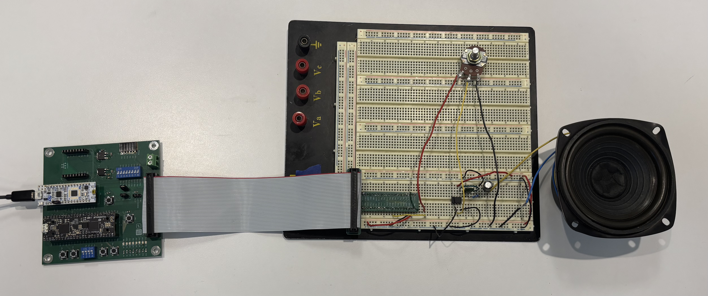
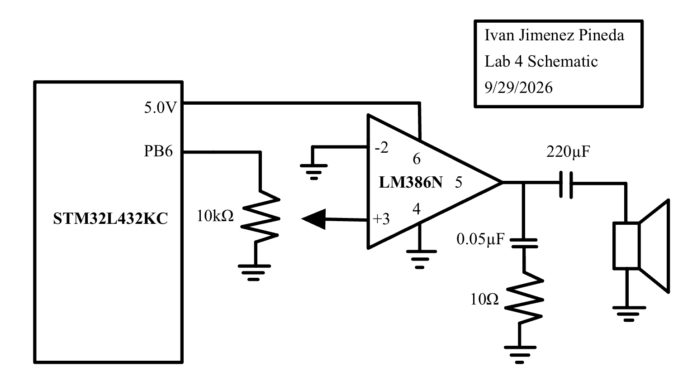
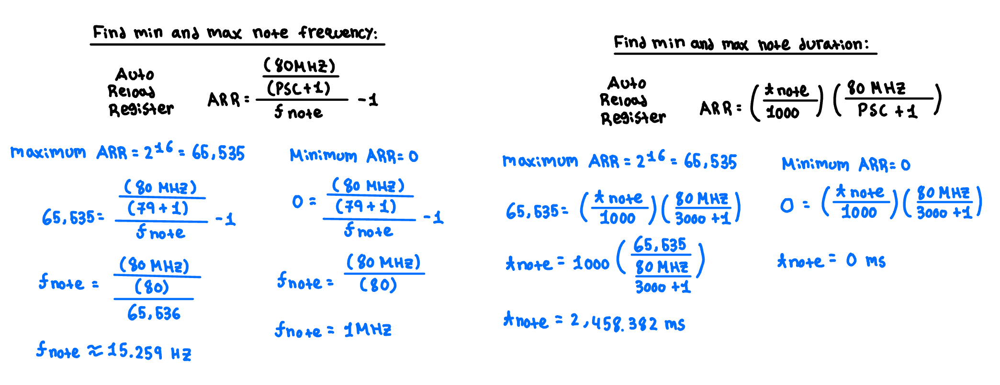
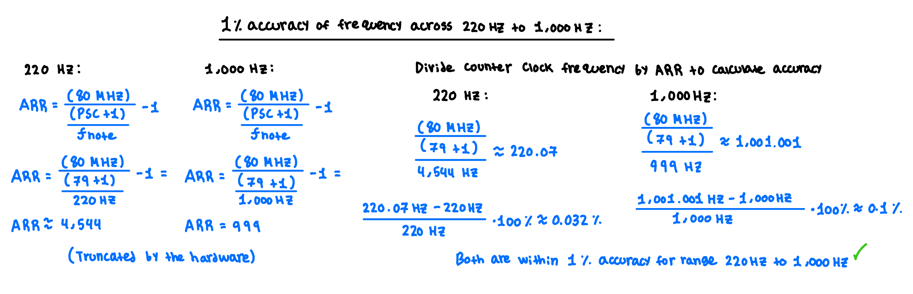

## Introduction

This lab focuses on utilizing the internal peripheral timers of the STM32L432KC microcontroller to generate digital audio. By producing precisely timed PWM square waves, the microcontroller functions as a digital synthesizer capable of playing musical sequences with varying pitches and durations. The system was programmed in C to play Beethoven's *Für Elise* and the *Super Mario Bros.* theme by interacting directly with memory-mapped hardware registers. An external LM386 audio amplifier circuit was constructed to safely drive an 8-ohm speaker, incorporating a potentiometer for manual volume control.

*Figure 1: Complete breadboard wiring including the STM32L432KC, LM386 amplifier, and speaker.*

[View the Source Code on GitHub](https://github.com/IvanJimenezPineda4/E155-Lab-4)

---

## Hardware Design

Driving an 8-ohm speaker directly from the microcontroller's GPIO pins would draw excessive current, risking permanent damage to the MCU. To safely buffer the signal and provide sufficient driving current, an LM386 audio amplifier was placed between the MCU and the speaker. 

The audio signal is generated via PWM on pin **PB6**, which corresponds to the complementary timer output `TIM16_CH1N`. This signal is routed through a 10 kΩ potentiometer acting as a voltage divider, allowing the attenuation of the input signal to the LM386 amplifier for volume control. The output of the LM386 passes through a 220 µF series capacitor accompanied by a 0.05 µF capacitor and 10 Ω resistor in series to ground to provide high-frequency stability. Additionally, pin **PB3** is configured as a standard digital output connected internally to the Nucleo board's LD3 LED, flashing in sync with every played note to provide visual feedback.

*Figure 2: Schematic of the off-board audio amplification circuit.*

---

## Software Architecture

The software manipulates memory-mapped registers directly using custom C structs (`FLASH_TypeDef`, `GPIO`, `TIM_TypeDef`, `RCC_TypeDef`) to enable clocks, configure pins, and control timers. Two hardware timers coordinate the audio playback:

*   **TIM16 (Pitch Generation):** `TIM16` is configured in PWM Mode 1 to generate the square waves for the audio frequencies. The system clock (80 MHz) is stepped down using a prescaler (`PSC`) of 79, resulting in a 1 MHz timer clock. The Auto-Reload Register (`ARR`) is updated for each note to set the pitch, while the Capture Compare Register (`CCR1`) is set to half the `ARR` value to maintain a 50% duty cycle. Because PB6 is a complementary output, bit 2 (`CC1NE`) of the `CCER` register is toggled to enable and disable the audio output, properly handling rests (0 Hz).

*   **TIM15 (Duration Control):** `TIM15` manages the timing delays that dictate how long each note is held. It utilizes a prescaler of 3000 to slow the timer count, preventing 16-bit register overflow during long notes. The program stops execution by using the `TIM15` Status Register (`SR`) update interrupt flag (`UIF`) until the specified duration elapses.

---

## System Calculations

### Frequency Range and Duration Range
`TIM16` generates the PWM frequency, fed by an 80 MHz clock with a prescaler (PSC) of 79. `TIM15` manages the note delays using a prescaler of 3000.

*Figure 3: Calculations of the Frequency Range and Duration Range .*

### Frequency Accuracy
The design must replicate notes within a 1% accuracy margin between 220 Hz and 1000 Hz. The error stems from integer truncation when calculating the `ARR` value. Checking these bounds is sufficient to prove compliance. Because integer truncation causes the frequency error, higher frequencies which require smaller `ARR` values suffer from larger percentage errors. 

*Figure 4: Calculations of the Frequency Accuracy across 220Hz to 1,000Hz .*

---

## Statement of Requirements

The digital audio system meets all Proficiency and Excellence requirements for Lab 4. The design successfully plays both *Für Elise* and the *Super Mario Bros.* theme at their correct tempos. The hardware utilizes an LM386 audio amplifier to safely drive the speaker and includes a potentiometer for volume control. The software defines all memory-mapped registers manually using custom C structs, avoiding CMSIS headers entirely. Note durations and rests are managed using hardware timers, and all frequency calculations avoid division-by-zero errors.

---

## AI Prototype Reflection

**Quality and Speed of Output:**
The quality of the ChatGPT5's output was faster than manually searching through the 1600-page STM32L432KC Reference Manual. Instead of utilizing `Ctrl-F` to hunt for scattered information across the RCC and Timer chapters, the LLM immediately synthesized the necessary configuration steps and provided the core equation for frequency.

**Reasoning and Timer Selection:**
The LLM recommended using `TIM2` because of its 32-bit counter and 4-channel GPIO routing. Because the target frequency range was only 220 Hz to 1 kHz, the 16-bit counters of TIM15 and TIM16 were more than sufficient, and `TIM16_CH1N` routed perfectly to my chosen output pin (PB6). 

**Document Search**
The most impressive part of the interaction occurred when the RM0394 manual was attached to the prompt. As a document search assistant, the LLM proved better to standard keyword searches.

**Time Spent:**
Approximately 17 hours were spent developing, debugging, and documenting this lab.