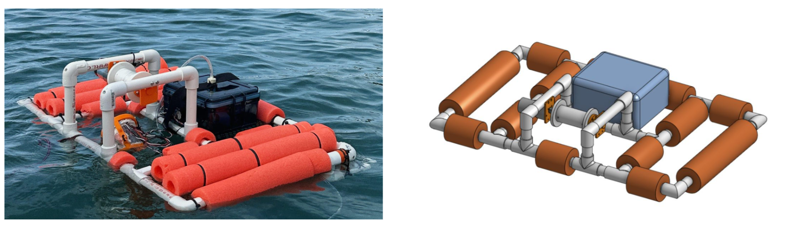
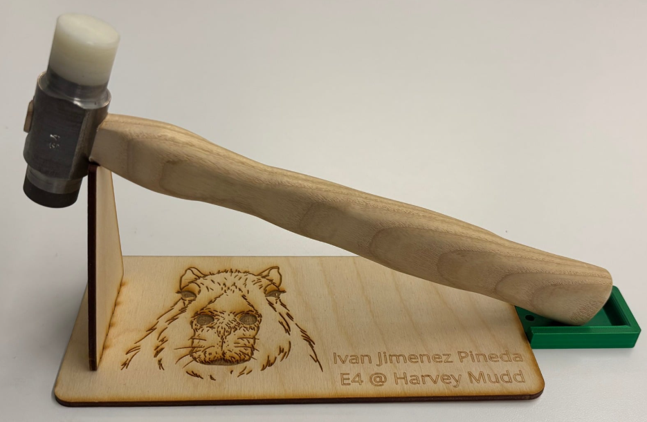
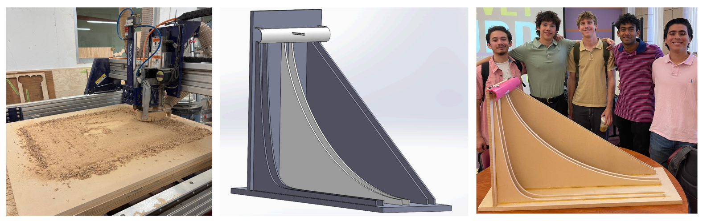
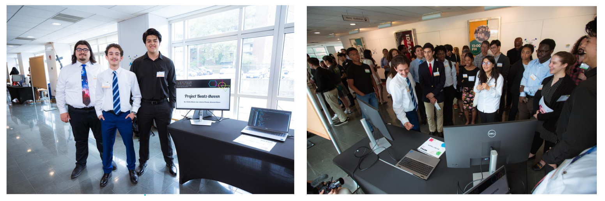

### Autonomous Underwater Vehicle
*August 2025 - May 2026*

* Engineered and fabricated a low-cost autonomous electro-mechanical robot featuring a custom winch mechanism to deploy a tethered sensor payload for depth-resolved environmental data collection.
* Designed analog signal conditioning circuitry, utilizing unity gain and inverting offset operational amplifiers, to interface an NTC thermistor, pressure sensor, and amorphous silicon solar cell with a Teensy microcontroller.
* Programmed the Teensy using Arduino IDE for synchronized sensor logging and utilized MATLAB to calibrate raw data, capturing temperature and luminosity fluctuations relative to depth during coastal field deployments at Dana Point Harbor.

### Project Presentation Poster

[Open Full Poster in New Tab](E80_Poster.pdf){.btn .btn-outline-primary target="_blank"}

<iframe src="E80_Poster.pdf" width="100%" height="800px" style="border: none; margin-top: 20px;"></iframe>

### Project Report

[Open Full Report in New Tab](E80_Final_Report_Ivan_Jimenez_Pineda.pdf){.btn .btn-outline-primary target="_blank"}

<iframe src="E80_Final_Report_Ivan_Jimenez_Pineda.pdf" width="100%" height="800px" style="border: none; margin-top: 20px;"></iframe>

### The Machinist's Hammer
*March 2025 - April 2025*

* Machined a multi-material alloy steel hammer including a hard face, soft face, handle, and a stand (AISI 4340 and AISI 1015).
* Applied heat treatment (857°C) to hard face and verified results using a Rockwell hardness tester (RC 43-48).
* Used a mill, lathe, vertical bandsaw, belt sander, sand blaster, laser cutter, and 3D printer.

### Brachistochrone Curve Model
*February 2025 - May 2025*

* Modeled cycloid, linear, and parabolic descent paths in SolidWorks using the Equation Driven Curve feature to optimize geometric accuracy and demonstrate kinematic principles for a client-requested physics demonstration.
* Fabricated the primary ramp structures and custom corner fixtures using a CNC Router, ensuring precise assembly and tolerances.

### MITES Summer Scholar Symposium Project
*June 2023 - July 2023*

* Co-developed "Project Beatzthoven," an interactive machine learning application built in Python that algorithmically generates classical music utilizing Markov Chain logic.
* Applied systematic debugging practices and software engineering fundamentals to process data structures and balance competing project priorities within a strict 6-week development cycle to present at an MIT showcase.