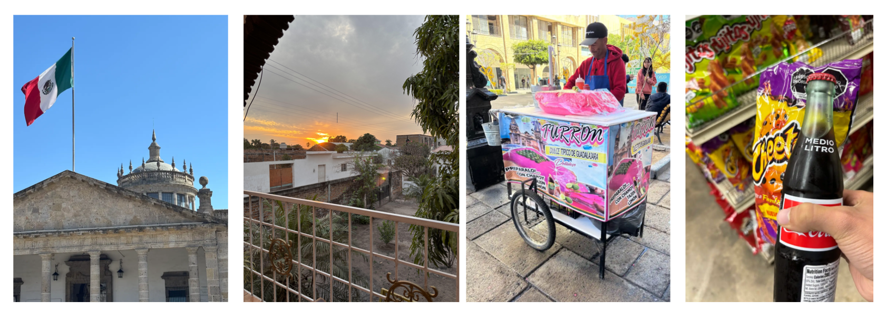
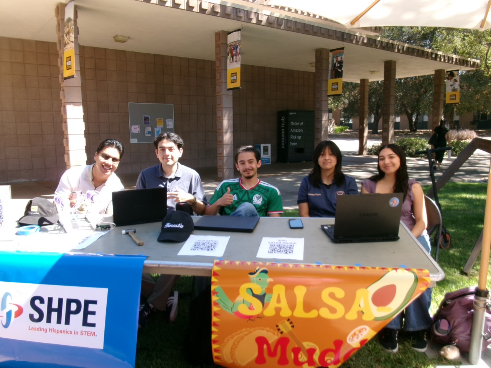
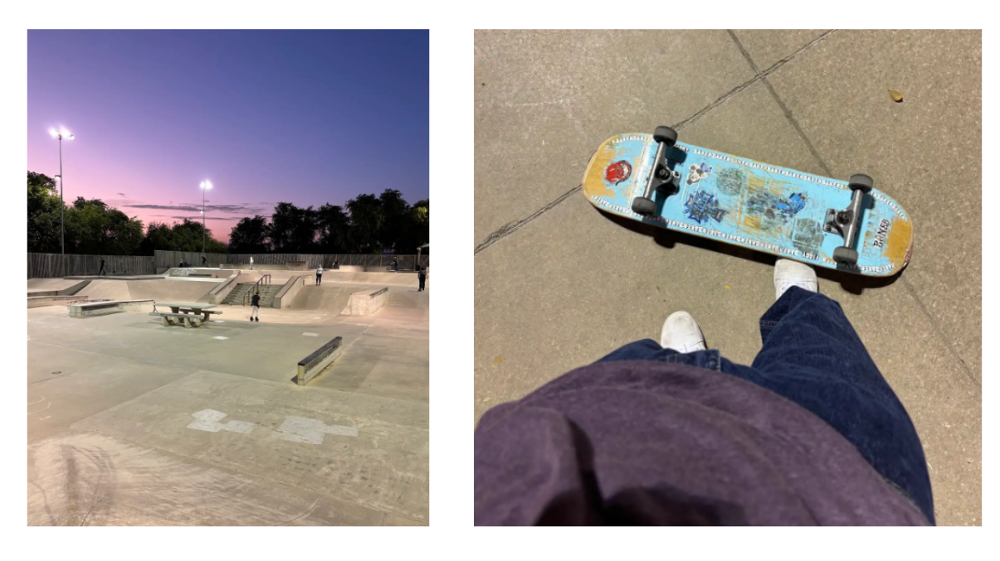
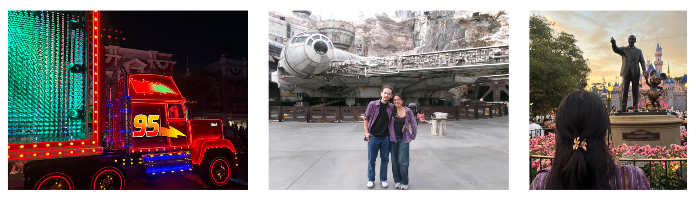
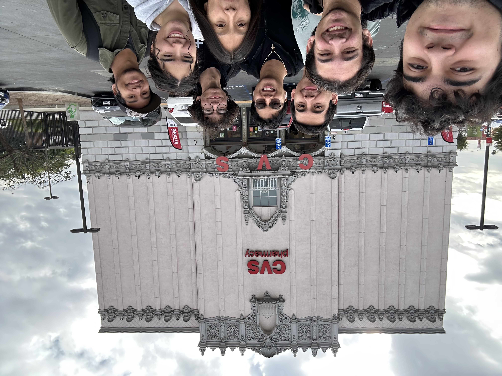

### Who is Ivan outside of the classroom? Does he have a life?

Beleive it or not, yes, I do like to live outside of problem sets and academic projects! I have many hobbies and interests that I am passionate about and am always happy to talk about. Most notably, I am very proud of my roots as a First-Generation Low-Income Latino Student! I am currently at Harvey Mudd College seeking a better future for my family who have sacrificed plenty in order to provide me the opportunity to attend college and pursue engineering. So, of course I always love to visit my parent's homeland in Mexico whenever possible!

I am passionate about my Latino heritage and proud to be one of the co-presidents of SALSA Mudd (Society for the Advancement of Latinx Students At Mudd). Uplifting the Latinx community at Harvey Mudd is an important mission that my friends and I care deeply about and share by hosting weekly club meetings and hosting events such as carne asadas, resume and interview workshops, career fair preparation events, and weekly study breaks to build community!

Besides that, I love skateboarding! I randomly picked up the hobby one day in high school because my mom kept telling me to go outside and I have loved it ever since. I know how to do ollies, pop shuvs, front-side 180s, and back-side 180s even though it came at the cost of many bruises and scars. I hope to keep improving my skateboarding skills before I become too old for it!

As a kid, I always wished for an opportunity to visit Disneyland. Sadly, that day never came for me as a kid due to the financial struggles that my family was facing. However, that didn't stop the grown up version of me from finally going! During my 2026 Summer Mechanical Engineering internship at ALLFAST, I had started saving some cash to finally make that wish a reality for my inner child. Here are some pictures that I took at Disneyland this summer with my beautiful girlfriend Joselyn! p.s. my favorite ride was the Guardians of the Galaxy ride.

Lastly, this is this very strange, evil-looking CVS Pharmacy in California that my friends and I became obsessed with and drove out to visit!

